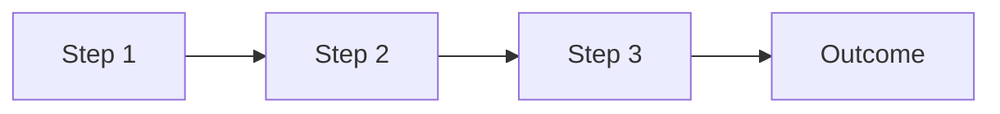

# Video Analysis: [Video Title]

## 📋 Metadata
- **Video Title**: 
- **Source URL**: 
- **Duration**: 
- **Date Analyzed**: 
- **Analyst**: Murray Kopit
- **Relevance to Epiroc**: [High/Medium/Low]

## 🎯 Executive Summary
[2-3 sentence overview of the video's value and main teaching points]

## 🔍 Detailed Analysis

### 1. Core Concepts Covered
- **Concept 1**: [Description and importance]
- **Concept 2**: [Description and importance]
- **Concept 3**: [Description and importance]

### 2. Technical Demonstrations
| Feature | Description | Epiroc Application |
|---------|-------------|-------------------|
| [Feature 1] | [What was shown] | [How we use it] |
| [Feature 2] | [What was shown] | [How we use it] |

### 3. Workflows & Processes

[Description of workflow]

### 4. Best Practices Identified
1. **Practice**: [Description]
   - Benefit: [Why it matters]
   - Implementation: [How to apply]

2. **Practice**: [Description]
   - Benefit: [Why it matters]
   - Implementation: [How to apply]

## 💡 Key Takeaways

### Immediate Actions
- [ ] [Action item 1]
- [ ] [Action item 2]
- [ ] [Action item 3]

### Skills to Develop
- [Skill 1]: [Why and how]
- [Skill 2]: [Why and how]

### Questions Raised
- Q: [Question that needs follow-up]
- Q: [Question that needs follow-up]

## 🏢 Epiroc-Specific Applications

### Mining Equipment Context
[How this applies to underground/surface equipment management]

### Compliance & Safety
[Relevant to MSHA or safety documentation]

### Battery-Electric Vehicle Integration
[If applicable to BEV equipment]

## 🔧 Technical Details

### Commands/Shortcuts
```
[Command 1]: [Function]
[Command 2]: [Function]
```

### API Endpoints Mentioned
- `[GET/POST] /endpoint`: [Purpose]

### Configuration Settings
```yaml
setting1: value
setting2: value
```

## 📊 Time Analysis

| Segment | Start | End | Topic | Importance |
|---------|-------|-----|-------|------------|
| Intro | 00:00 | 01:30 | Overview | Low |
| Demo 1 | 01:30 | 05:45 | [Topic] | High |
| Demo 2 | 05:45 | 10:00 | [Topic] | Medium |

## 🔗 Related Resources

### Internal Documentation
- [Link to relevant internal doc]

### External Resources
- [Siemens documentation link]

### Follow-up Videos
- [Next video in series]

## 📝 Notes & Observations

### Strengths
- [What was well explained]

### Gaps
- [What was missing or unclear]

### Opportunities
- [How we can leverage this knowledge]

## ✅ Action Items

| Priority | Action | Owner | Due Date |
|----------|--------|-------|----------|
| High | [Action] | [Person] | [Date] |
| Medium | [Action] | [Person] | [Date] |
| Low | [Action] | [Person] | [Date] |

## 🏷️ Tags
`#teamcenter` `#training` `#[specific-feature]` `#epiroc`

---
*Analysis completed on [Date] for Epiroc Pitt Meadows BC facility*